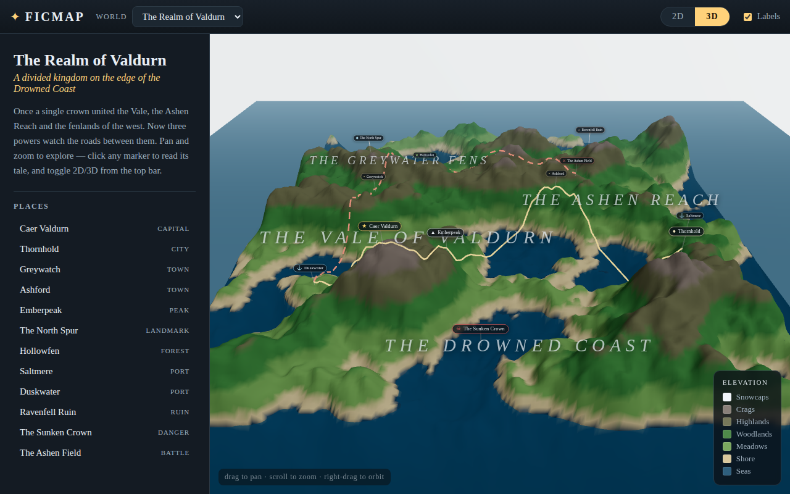

# Ficmap — an atlas of fictional worlds

Interactive **2D / 3D maps for made-up worlds**, in the browser. Each "story"
is a small data file describing a world; the engine builds the terrain from a
seed (or a real-elevation / hand-shaped heightmap) and drapes your cities, roads
and regions onto it. Pan and zoom like a web map, tilt into 3D, click a place to
read its lore.

Built with **React + react-three-fiber (Three.js)** and **Vite**. No backend —
it's a static site.



## Quick start

```bash
npm install
npm run dev        # http://localhost:5173
npm run build      # static output in dist/
npm run preview    # serve the production build
npm test           # Playwright e2e tests (see below)
```

### Tests

End-to-end tests (`e2e/`, Playwright) cover **all demo scenarios** — every
world loads without errors, plus the 2D/3D toggle, chapter playback,
cross-chapter references, artifact journeys, floor switching (Põrgu, the
Center-of-the-Earth subfloors, Valdurn's sky realms, Mistborn's two eras), the
per-book/film filter, the layers menu, the Estonian language toggle, and URL
deep-links. `npm test` starts a dev server and runs them.
It uses the environment's preinstalled Chromium via `executablePath`; point
`PW_CHROMIUM` at a different binary if needed.

## Deploy (GitHub Pages)

A workflow at `.github/workflows/deploy.yml` builds the site and publishes it to
GitHub Pages on every push to the default branch (and can be run manually from
the Actions tab).

**One-time setup:** in the repo, go to **Settings → Pages → Build and
deployment** and set **Source: "GitHub Actions"**. After the next push the site
goes live at:

```
https://livenson.github.io/ficmap/
```

The Vite `base` is already set to `./` so assets resolve correctly under the
`/ficmap/` project-page path.

## The idea

- **Worlds are data, not code.** A world is one `Story` object (see
  `src/types.ts`). Change a seed and you get an entirely different landmass;
  change the biome palette and the same terrain becomes tropical, arctic or
  volcanic.
- **Deterministic terrain.** Height is fractal noise seeded by a string, so the
  same story always renders the same land on every machine — no giant heightmap
  images to ship. (`src/engine/noise.ts`)
- **Place in 2D, render in 3D.** You give every marker/route a flat `(x, z)`
  coordinate in the range `[-1, 1]`; the engine looks up the terrain height and
  snaps it onto the surface. (`src/engine/terrain.ts`)

## The worlds

Twenty-four worlds ship in the atlas, mixing procedural, real-DEM and hand-shaped
terrain:

- **The Realm of Valdurn** — an original demo kingdom that climbs to the
  **Empyrean** sky realm and drops to the **Sunless Deep** (procedural).
- **Kalevipoeg** — the Estonian national epic over a real Estonia, three books,
  with the **Põrgu** underworld.
- **The Fellowship of the Ring** — Eriador, a shaped heightmap echoing Tolkien's
  map (the Misty Mountains, the Shire, Mirkwood, Erebor).
- **Journey to the Center of the Earth** — an Iceland surface over three
  descending subfloors (Verne).
- **The Extraordinary Voyages** — four Jules Verne novels on the real whole
  Earth.
- **The d'Artagnan Romances** — Dumas's three Musketeers novels over real France
  and England.
- **Harry Potter** — wizarding Britain over a real Britain DEM, with post owls.
- **The Adventures of Indiana Jones** — real-Earth DEM, with a per-film filter.
- **Mistborn** — Scadrial's Final Empire, a shaped heightmap, across two eras.
- **The Forest Song** — Lesya Ukrainka's Volhynian Polissia forest, with
  drifting will-o'-the-wisp spirits.
- **Eneida** — Kotliarevsky's Cossack *Aeneid*: a Mediterranean voyage with
  **Olympus** above and **Peklo** below.
- **A Song of Ice and Fire** — Westeros traced from the canonical map, with
  ravens, wights and fire-breathing dragons.
- **Lāčplēsis** — the Latvian national epic over a real Latvia, following the
  Daugava, with **Pērkons's Hall** above and **the Crystal Castle** below.
- **Wilhelm Tell** — Schiller's play over a real Lake Lucerne; the first world
  here built on genuine mountains rather than flat or capped terrain.
- **The Nibelungenlied** — the German epic as what it is, a road: the Rhine at
  Xanten and Worms, then the whole Danube east to Etzel's hall, drawn twice
  because the poem travels it twice.
- **Faust** — Goethe's both parts over central Germany, with the two floors the
  text itself supplies: **the Mothers** below and **the Mountain Gorges** above.
- **Tijl Uilenspiegel** — De Coster's Belgian epic across Flanders and the
  Zeeland estuaries: a book that starts on land and wins at sea.
- **The Kalevala** — Lönnrot's Finnish epic over Karelia, built around the one
  road the whole poem travels, Wainola to Pohyola, with **Tuonela** below.
- **Peer Gynt** — Ibsen's five acts over southern Norway, framed by the three
  mountains Peer greets from a ship's deck in Act V, with **the Dovre-King's
  Hall** below. Plays Grieg's own *Morgenstemning*, transcribed from the score.
- **Nils Holgersson** — Lagerlöf's school geography reader flown end to end,
  Skåne to Lapland and home the western way. The first world here that is
  taller than it is wide.
- **Táin Bó Cúailnge** — the Irish cattle-raid as what it is, a road: Connacht
  to the Cooley peninsula, held up one ford at a time by a seventeen-year-old.
- **The Poem of the Cid** — the most literally mappable epic here. The poem
  names its stages like an itinerary, and this map just follows them: Bivar to
  Burgos, down the Jalón, on to Valencia, and back to the oak-wood of Corpes.
- **Te Ika-a-Māui** — Aotearoa New Zealand, where the land itself is the story:
  the North Island is the fish Māui hauled up, the South Island the canoe he
  stood in, Rakiura the anchor stone. Read from Dittmer's 1907 collection, with
  a note in the file about what that source is and is not.
- **For the Term of His Natural Life** — Marcus Clarke's convict novel over a
  real Van Diemen's Land: Hobart, Macquarie Harbour behind Hell's Gates, and
  the peninsula sealed by a line of chained dogs at Eaglehawk Neck.

The picker groups them into sections (national epics, classic adventure, modern
fantasy, original) with a filter box, since a flat list stopped being readable
somewhere around ten.

## Add your own world

1. Copy `src/stories/valdurn.ts` to `src/stories/my-world.ts`.
2. Edit it — pick a `seed`, tune the terrain, place your markers/routes/regions.
3. Register it in `src/stories/index.ts`:

   ```ts
   import { myWorld } from './my-world'
   export const stories: Story[] = [valdurn, myWorld]
   ```

That's the whole extension surface. No engine changes required.

### Placing things on land

Coordinates run `x: -1 (west) → 1 (east)`, `z: -1 (north) → 1 (south)`, with the
world centered at `(0, 0)`. A marker dropped in the sea just floats at the
shoreline, so to place cities on solid ground, preview the terrain first:

```bash
node scripts/preview.mjs <seed> <seaLevel> <islandFalloff> <frequency>
# e.g. node scripts/preview.mjs valdurn-5 0.36 0.25 1.4
```

It prints an ASCII map (`~` = sea) plus a list of verified land coordinates you
can paste straight into your story.

For a **real-DEM** world the coordinates come from a real map instead, so the
risk is the reverse — a town that quietly lands in the sea. Check a finished
world against its own heightmap:

```bash
node scripts/check-markers.mjs latvia
```

It samples the DEM at every surface marker, prints the `lon/lat` each one
resolves back to, and fails if a land marker is under water. Markers that are
*meant* to be wet (islands, sea roads, a castle sunk in a lake) are listed in
the script's `wet` set. This is how Burtnieks was caught sitting in the middle
of its own lake rather than on its shore.

The 3D scene can be profiled per world, on the production build, with no hooks
in the source — the WebGL context's own methods are patched in the page, so
every draw call, buffer and texture upload is counted as it happens:

```bash
npm run build && npx vite preview --port 5210 &
node scripts/profile-worlds.mjs             # all worlds
node scripts/profile-worlds.mjs verne-voyages
```

It reports fps, median/p95 frame time, draws and triangles per frame, geometry
and texture bytes, and JS heap. This is how terrain self-shadowing was found to
be doubling the triangle count on every world.

Route coverage is checked across the **whole atlas**, not just the DEM worlds:

```bash
node scripts/check-routes.mjs          # every world, every floor
node scripts/check-routes.mjs kalevala # just one
```

It bundles the real story data with esbuild and imports it, so it sees exactly
what the app sees — every level, every marker, no regex guesswork. A place
counts as connected when a route passes within 0.09 map units of it, or when it
is declared scenic in the script (a summit you only ever look at). This found 71
places with no route to them, including a whole world — The Forest Song — that
had no routes at all.

The terrain's zoom-dependent detail is checked the same way, without a browser:

```bash
node scripts/check-lod.mjs
```

Zoomed out, the world map draws one uniform mesh. Zoomed in, it draws a coarse
base with a rectangular hole and a fine patch filling it — fewer triangles, and
the ground under the camera sampled several times more closely. The script puts
a real camera exactly where the app puts it and checks both, plus that the two
meshes meet without a crack and that the patch never tessellates finer than the
heightmap holds. It is a script rather than an end-to-end test because zoom in a
headless browser is damped over frames at about one frame a second, so a test
that turns the wheel and waits cannot tell a camera that never moved from a
feature that never fired.

## Elevation data

The whole-Earth map is 13 km per pixel; Peer Gynt's Norway is 1.3. That gap is
data, not geometry, and it is why the world map softens when you zoom in. A
finer layer is cut into tiles that the app fetches only for the part of the map
you are looking at:

```bash
node scripts/build-dem-tiles.mjs world     # 230 tiles, ~24 MB, ~2 min
node scripts/check-dem-tiles.mjs world
```

Tiles are cut with exactly the parameters their base map was cut with, over the
same **pinned** metre range — otherwise a tile, seeing only its own corner of
the world, would scale its bytes to different extremes and the ground would step
where the two met. `scripts/check-dem-scale.mjs` reports which presets are
pinned and so safe to cut from, and cross-checks each against the waterline its
story declares. `check-dem-tiles.mjs` then measures whether the tiles sit on the
base map rather than above or below it — cutting one row over the wrong range
moves it by 9 of 255, against 0.03 for the whole set as shipped.

Scores get the same treatment. The tunes are synthesised live, so a test cannot
hear them — but it can check that the written bass actually lands where the
score says it does, underneath the melody:

```bash
node scripts/check-music.mjs
```

It replays the sequencer over every world's melody/bass pair and reports the
worst gap between a bass note's written beat and where it really sounds. This
is how the bass was caught wandering: most melodies are not a whole number of
bass notes long, the bass ran on its own clock, and within a couple of loops
the low part was playing a chord that had nothing to do with the tune above it.

It also checks **route coverage** — every place should have some line of travel
running to it, or it is a dot nobody ever goes to. Markers further than `reach`
from every route are reported.

A country as flat as Latvia needs one more thing. Rīga stands about 13 m above
the sea in a DEM whose range is several hundred metres, so the coastal plain
lands a hair above the shoreline and the rendered water plane swallows it. The
`latvia` preset sets `landGamma`, which lifts low ground far more than high
ground and leaves the coastline exactly where the DEM puts it. Reach for it
whenever a lowland world looks flooded.

An inland world has the opposite problem: there is no sea, so there is no
waterline. The `lucerne` preset names one with `seaM` — the elevation of the
lake surface, which a DEM records as a flat plateau — and carves everything at
or below it into water.

## The data model (`src/types.ts`)

| Field | What it does |
|-------|--------------|
| `terrain.seed` | Any string. Same seed → same world. |
| `terrain.frequency` | Feature size. Lower = larger continents. |
| `terrain.seaLevel` | Fraction of height that is underwater (0–1). |
| `terrain.islandFalloff` | 0 = land runs to the edges, 1 = strong island shape. |
| `terrain.heightScale` | Vertical exaggeration of the 3D mesh. |
| `terrain.biomes[]` | Elevation → color bands (low to high). |
| `terrain.rivers` | Number of rivers traced downhill from highlands to sea (`riverColor` to tint — e.g. lava-orange). |
| `terrain.heightmap` | Optional grayscale image URL — sampled elevation instead of noise. Some worlds use a **real DEM**: **Kalevipoeg** (Estonia), **The d'Artagnan Romances** (France + England), **Harry Potter** (Britain), **The Extraordinary Voyages** and **The Adventures of Indiana Jones** (the whole Earth), **Eneida** (the Mediterranean), **Lāčplēsis** (Latvia), **Wilhelm Tell** (Lake Lucerne), **The Nibelungenlied** (the Rhine + Danube), **Faust** (the Harz), **Tijl Uilenspiegel** (Flanders), **The Kalevala** (Karelia), **Peer Gynt** (southern Norway), **Nils Holgersson** (Sweden), **Táin Bó Cúailnge** (Ireland), **The Poem of the Cid** (Spain), **Te Ika-a-Māui** (New Zealand), **For the Term of His Natural Life** (Tasmania). Build these with `node scripts/build-heightmap.mjs [estonia\|france\|britain\|world\|mediterranean\|latvia\|lucerne\|nibelungen\|harz\|flanders\|karelia\|norway\|sweden\|ireland\|spain\|aotearoa\|tasmania]` (some presets also carve real lakes from Natural Earth data). Others use a **shaped** heightmap — hand-built to echo a canonical map — via their own script: **The Fellowship of the Ring** (`build-middle-earth.mjs`), **Mistborn** (`build-scadrial.mjs`), **The Forest Song** (`build-polissia.mjs`). Place markers at real `lon/lat` mapped into the DEM's box. |
| `terrain.meshResolution` | Terrain mesh segments per side (default 320; a wide world multiplies it by its aspect so cells stay square). The two whole-Earth maps set `440`, because a world map is the one place where coastline shape is the subject and the default spends a vertex per ~48 km. Check `scripts/profile-worlds.mjs` after changing it. |
| `terrain.aspect` | World width ÷ depth (default 1 = square). Use >1 for a map wider than it is tall — **The Extraordinary Voyages** sets `360/140` so the equirectangular Earth keeps real proportions instead of stretching into the square — or <1 for one taller than it is wide: **Nils Holgersson** sets `0.482` because Sweden is 777 km across and 1,611 km down. The camera, the haze, the sea plane and the shadow frustum all scale off it. |
| `terrain.detail` | Adds fine surface relief (a tiled procedural bump map) so light picks out rockiness up close. On for the shaped-terrain worlds (FOTR, Mistborn, The Forest Song). |
| `terrain.sky` | Sky mood: `'day'` (default), `'dark'` (warm hellfire underworld), `'cavern'` (cool phosphorescence), `'heaven'` (a luminous cloud-sea sky realm). |
| `markers[]` | Labeled points of interest (`capital`, `city`, `port`, `ruin`, …). |
| `routes[]` | Journeys/roads drawn draped over the terrain. |
| `regions[]` | Ambient area names floated over the map. |
| `elements[]` | Tracked artifacts (a crown, a sword) with a `journey` of stops; shown on the map wherever they are for the current chapter, so they visibly move. |
| `chapters[]` | Optional guided tour — see below. |
| `books[]` | Multi-book tour: one shared map, several books each with their own `chapters`. References then span books ("Bk 2 · Ch 3"). |
| `ambient` | 3D-only life: `{ trees, treeKind, treeColor, birds, birdKind, dragons, mosquitoes, rain, fish, wisps }`. Trees scatter across wooded elevations; **birds** circle (or **post owls** with `birdKind: 'owl'`, or glowing **angels** over a `'heaven'` sky); **dragons** wheel and **breathe fire**; **fish** school under the sea; **wisps** drift as will-o'-the-wisp lights over marsh and water (see **The Forest Song**); `mosquitoes` swarm; `rain: true` brings clouds + animated rain (see **Kalevipoeg**). Shown only in 3D, under the "Trees & wildlife" layer. |

## Story mode (chapters)

Give a story a `chapters` array and a **▶ Play story** button appears. Each
chapter is one beat of a guided tour:

```ts
chapters: [
  {
    id: 'old-seat',
    title: 'The Old Seat',
    narration: 'In the southern peaks stands Caer Valdurn…',
    focus: { marker: 'caer-valdurn', distance: 34, pitch: 30, heading: 15 },
    reveal: { markers: ['duskwater'] },       // added to what's visible, cumulative
    highlight: { markers: ['caer-valdurn'] }, // glows; everything else dims
  },
  // …
]
```

- **`focus`** flies the camera to a `marker` (or an explicit `at` point), from
  `distance` world units away, at a `pitch`/`heading` (3D only). Both 2D and 3D
  are supported; the camera eases in, then hands control back to the viewer.
- **`reveal`** unveils markers/routes/regions as the tale progresses — ids are
  cumulative from chapter 0 onward, so the map unfolds. Categories nobody
  reveals stay fully visible. Omit `chapters` entirely and nothing changes.
- **`highlight`** emphasizes the current beat's markers/routes.

Navigate with the panel's Prev/Next, the chapter rail, or the **← / →** keys;
**Esc** exits.

### Multi-book worlds

For a saga that spans several books over one shared map, use `books` instead of
`chapters`:

```ts
books: [
  { id: 'birth', title: 'Birth & the Sword', chapters: [ /* … */ ] },
  { id: 'wars',  title: 'Wars & Wanderings', chapters: [ /* … */ ] },
]
```

Playback flows across books in order, the chapter rail groups under book
headings, and a place's **references span books** — click the Kääpa brook in
the **Kalevipoeg** sample and you'll see it surface in both *Wars & Wanderings*
and *Põrgu & the End*. `chapters` and `books` are interchangeable; a plain
`chapters` run is just a single implicit book.

This shines when several works share one geography. **The Extraordinary
Voyages** puts four Jules Verne novels (*Around the World in Eighty Days*,
*Twenty Thousand Leagues*, *The Mysterious Island*, *From the Earth to the
Moon*) on the real **whole Earth** as four books; **The d'Artagnan Romances**
does the same for Dumas's three Musketeers novels over the real **France and
England**. (Because a global map is wider than tall, the world stretches
vertically in the square view, and the round-the-world route wraps off the east
edge and back in the west.)

### Map levels (floors)

A world can have levels above or below the surface — an underworld, a dungeon,
a sky realm. Add `levels` (each with its own `terrain`, `markers`, etc.) and a
**floor switcher** appears, ordered like an elevator by each level's `tier`
(surface `0`, sky realms positive, underworlds negative). A chapter's `level` id
makes the guided tour **change floors** automatically, and each level sets its
own `sky` mood — `'dark'` (hellfire), `'cavern'` (phosphorescence) or
`'heaven'` (a luminous cloud-sea). Try **Kalevipoeg** → descend into **Põrgu**;
**Journey to the Center of the Earth** → three subfloors (a volcanic chimney,
the Lidenbrock Sea, the deep caverns); **Valdurn**, which climbs to the
**Empyrean** and drops to the **Sunless Deep**; or **Eneida**, whose tour rises
to **Olympus** and descends into **Peklo**.

```ts
levels: [{ id: 'porgu', title: 'Põrgu', terrain: { /* dark, sky: 'dark' */ }, markers: [...] }],
// and on a chapter:
{ id: 'porgu', title: 'The Gates of Põrgu', level: 'porgu', focus: { marker: 'sarvik-hall' }, ... }
```

### Tracked artifacts

Give a world `elements` to track objects whose location matters — a crown, a
cursed sword. Each element has a `journey` of stops, each tied to a chapter it
moves in:

```ts
elements: [{
  id: 'sword', name: 'The Cursed Sword', glyph: '⚔',
  journey: [
    { marker: 'finland',   sinceChapter: 2, note: 'Forged, then cursed.' },
    { marker: 'lindanisa', sinceChapter: 4, note: 'Carried into the wars.' },
    { marker: 'kaapa',     sinceChapter: 6, note: 'Lost in the brook.' },
  ],
}]
```

On the map the artifact is drawn wherever it is for the current chapter, so it
**visibly travels** as the tour advances; click it to trace its whole journey.
Toggle the **Artifacts** layer to hide them. (Try the sword in **Kalevipoeg**
or the crown in **Valdurn**.)

## Around the map

A few more conveniences in the viewer:

- **Language toggle.** UI chrome and marker-kind labels switch between English
  and Estonian (`EN` / `ET`).
- **Per-source filter.** Worlds built from several books or films get a
  **Filter** dropdown that pares the map down to one source's own places and
  routes — see **The Adventures of Indiana Jones**.
- **Cross-world links.** A place can carry a `link` to the same event on
  another world's map, rendered as a door in its place card. **Lāčplēsis** and
  **Kalevipoeg** use it at the duel the two national epics share: Pumpurs sends
  his hero north to fight a giant called Kalapuisis, who is Kalev's son, so each
  map hands the reader to the other there.
- **Local weather.** `ambient.rainArea` confines a storm to one box of the map,
  so weather is something you travel into — **Lāčplēsis** keeps its rain over
  the northern, Estonian end.
- **Music.** A toggle plays a written melody per world and floor, synthesised
  live — no audio files. Public-domain and traditional tunes are credited on
  screen while they play (**Lāčplēsis** plays *Pūt, vējiņi*, the Daugava
  boatmen's song, transcribed from Andrejs Jurjāns' 1884 setting); the rest are
  originals and say so.
- **Collapsible panel.** A tab on the seam hides the side panel (a bottom sheet
  on mobile) to give the map the whole stage.
- **Deep-links.** State lives in the URL: `?world=`, `?floor=`, `?view=2d`,
  `?lang=et` — so any world, floor, view or language is directly shareable.

## Project layout

```
src/
  types.ts              # the Story data contract (start here)
  engine/               # pure, framework-free world generation
    noise.ts            #   seeded fractal height field
    terrain.ts          #   mesh builder + map↔world coordinates
    biomes.ts           #   elevation → color
  components/           # react-three-fiber scene
    MapScene.tsx        #   canvas, cameras (2D/3D), lighting, floor state
    Terrain / Water / Markers / Routes / Regions
    Flora / Wildlife / Wisps / SeaLife / Weather   # 3D ambient life
  ui/                   # DOM overlay: toolbar, info panel, legend,
                        #   floor switcher, per-source filter, story player
  stories/              # the worlds — add yours here
```

## Roadmap ideas

The architecture leaves room to grow without rework:

- Load worlds from external JSON / a CMS instead of bundled TS.
- Fog-of-war / exploration state, day–night lighting, animated routes.
- An in-browser editor that exports the same `Story` format.
